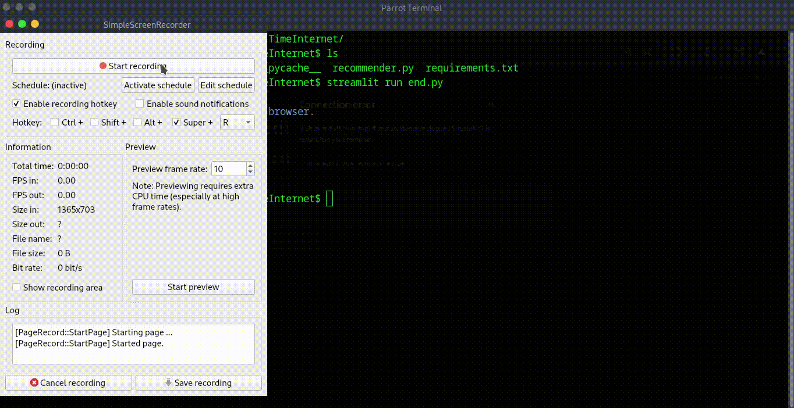

# Credit_Card_Recommender
This project is a semantic and heuristic-based credit card recommendation system. It leverages **LLama 3** through **Ollama** for semantic extraction of card details and combines it with a custom heuristic comparator for more personalized and precise recommendations.

The tool supports both a Command Line Interface (CLI) and a Frontend User Interface (UI) built using Streamlit.

---
## 🎥Demo


## 🚀 Features

- Semantic matching using LLaMA 3 (via Ollama)
- Heuristic comparator function for refined card recommendation
- CLI interface for quick access
- Streamlit UI for interactive exploration
- Modular and easy to extend

---

## 🛠 Setup

Clone the repository:

```bash
git clone https://github.com/kohlikadola/Credit_Card_Recommender.git
cd Credit_Card_Recommender/
Install dependencies:
pip install -r requirements.txt
For CLI
python3 app_cli.py
For GUI
streamlit run end.py
---


